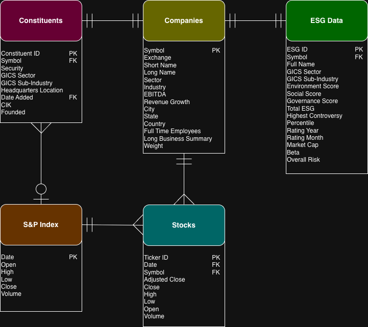

# DS 4320 Project 1: Forecasting Stock Performance

## Executive Summary

---

| Spec | Value |
|------|-------|
| Name | Mason Nicoletti |
| NetID | cxx6sw |
| DOI | [DOI Link]() |
| Press Release | [Headline]() |
| Data | [OneDrive Data Folder](https://myuva-my.sharepoint.com/:f:/r/personal/cxx6sw_virginia_edu/Documents/DS%204320%20Project%201/Data?csf=1&web=1&e=xrsKd2) |
| Pipeline | [Pipeline Files]() |
| License | [License]() |

---

## Problem Definition

## Domain Exposition

## Data Creation

### Provenance

The raw data used in this analysis was downloaded from several online sources.

1) The S&P 500 Companies table was acquired from a Kaggle page called "*S&P 500 Stocks (daily updated)*". The owner of this page is named Larxel, and the orginial data was collected from FRED and yfinance. Additionally, both the S&P 500 Index table and the S&P 500 Stocks table were downloaded from this same Kaggle page, each as an individual csv file.
   
2) The S&P 500 ESG Data table was acquired from a Kaggle page called "*S&P 500 ESG and Stocks Data 2023-24*". This page is owned by Rikin Zala, and it contains two separate files. The S&P 500 ESG Data csv file was downloaded for this analysis, while the S&P 500 Price Data csv file was not.
   
3) The S&P 500 Constituents table was acquired from a platform called DataHub, specifically from a page called "*S&P 500 Companies with Financial Information*". An available table of all S&P 500 constituents was downloaded as a csv file. The data on this page was originally aquired from the Standard and Poor's website, and it is updated regularly to reflect the current state of the index.

The five tables from these three sources were organized locally to support further data preparation.

### Code

**Table 2.** Code used for Data Creation

| Code | Description | Link |
|------|-------------|------|
| `data_prep.ipynb` | Loads in the raw data, performs transformations to establish relational model, uploads tables to DuckDB, and saves output files | [Link to data prep code](https://github.com/masonnicoletti/forecasting-stock-performance/blob/main/data_prep.ipynb)|

### Bias Identification

The S&P 500 stock dataset is susceptible to bias as it is constructed from companies that are selected for inclusion in the S&P 500 index, which represents only large-cap U.S. equities. This selection process introduces bias, as it does not capture small-cap or international companies, and therefore is not representative of the broader global equity market. As a result, any analysis performed using this dataset may not generalize to companies outside of the index. Additionally, survivorship bias may be present, as datasets that rely on current constituents may exclude companies that were previously part of the index but have since been removed due to poor performance or other factors. Furthermore, ESG metrics are derived from third-party rating agencies, which may introduce methodological bias due to differences in scoring criteria, weighting, and data availability across firms.

### Bias Mitigation

Bias within the S&P 500 dataset can be mitigated through the use of historical constituent data and careful integration of multiple data sources. By incorporating a time-varying constituents table, the dataset can account for changes in index membership over time, reducing the impact of survivorship bias and allowing for more accurate longitudinal analysis. Additionally, combining stock price data with index-level data provides a more complete view of market behavior, improving the robustness of analytical conclusions. ESG-related bias can be addressed by acknowledging differences in rating methodologies and, where possible, comparing scores across multiple providers or normalizing values within sectors. Finally, the large scale and high frequency of financial market data helps to reduce random variability, enabling more stable estimates and more reliable modeling outcomes when appropriate statistical methods are applied.

### Rationale

The construction of the S&P 500 relational model required selecting from multiple available sources of company, stock price, and index data collected over different time spans. This presented challenges, as the data with shorter time windows sometimes omitted important market cycles, while available data with longer windows did not always have data nearest to the present and may introduce inconsistencies due to changes in the S&P 500 constituents. In this project, a longer time horizon that includes near-present data was selected in order to balance historical depth with relevance to current market conditions. This decision allowed for more robust time-series analysis and improved the ability to capture trends across different economic periods, while acknowledging that data consistency may vary across the full time span.

Another important design decision involved structuring the relational model, particularly the use of primary keys and temporal alignment across tables. The `Date` variable was chosen as the primary key for the S&P 500 Index table, which also allows it to function as a natural connection point to other time-based tables such as stock prices and constituents. Additional primary keys were created in the S&P 500 ESG Data, S&P 500 Stocks, and S&P 500 Constituents tables to maintain integrity and support efficient joins. These decisions ensured that the dataset adheres to relational modeling principles. However, they also introduce considerations around data alignment, as mismatches in trading days or missing values across tables may affect downstream analysis if not handled carefully.

Finally, the analysis was limited to S&P 500 companies in order to capture a meaningful representation of the broader U.S. stock market. ESG data was incorporated to extend analysis beyond financial performance and include sustainability-related factors, though this introduces additional variability due to scoring methodologies. In data cleaning, features that reflected the current state of a company, such as real-time metrics, were removed from static tables. These decisions were made to create a database that adheres to the rules of the relational model and will be useful for analytics in forecasting stock performance based on a variety of factors.

## Metadata

### Schema

**Figure 1.** ERD of S&P 500 Model

### Data

**Table 3.** Data Tables

| Table | Description | Link |
|-------|-------------|------|
| Companies | Information about S&P 500 companies | [Link to sp500_companies.csv](https://myuva-my.sharepoint.com/:x:/r/personal/cxx6sw_virginia_edu/Documents/DS%204320%20Project%201/Data/csv/sp500_companies.csv?d=w018aa33171a64dafbb973df86d6e91a2&csf=1&web=1&e=gq4rqD) |
| ESG Data | ESG sustainability scores for S&P 500 companies | [Link to sp500_esg.csv](https://myuva-my.sharepoint.com/:x:/r/personal/cxx6sw_virginia_edu/Documents/DS%204320%20Project%201/Data/csv/sp500_esg.csv?d=w262ccc38a5e64f2f83ea3774310c3497&csf=1&web=1&e=Cd2t6G) |
| Stocks | Daily records (2014-2024) for S&P 500 companies | [Link to sp500_stocks.csv](https://myuva-my.sharepoint.com/:x:/r/personal/cxx6sw_virginia_edu/Documents/DS%204320%20Project%201/Data/csv/sp500_stocks.csv?d=w248e8eecd649454cbd0b90311f28ef51&csf=1&web=1&e=q2Whc7) |
| S&P Index | Daily record (1927-2026) of S&P 500 index | [Link to sp500_index.csv](https://myuva-my.sharepoint.com/:x:/r/personal/cxx6sw_virginia_edu/Documents/DS%204320%20Project%201/Data/csv/sp500_index.csv?d=w8bc98b055a494b8db279e87d73fda3e2&csf=1&web=1&e=hsryck) |
| Constituents | Additional information about S&P 500 companies | [Link to sp500_constituents.csv](https://myuva-my.sharepoint.com/:x:/r/personal/cxx6sw_virginia_edu/Documents/DS%204320%20Project%201/Data/csv/sp500_constituents.csv?d=w62325a5e97b748c08e2a6f08e0217165&csf=1&web=1&e=giOnBK) |

### Data Dictionary

**Table 4.** Companies Data Dictionary

| Name | Data Type | Description | Example | Uncertainty |
|----|----|----|----|----|
| Symbol | String | Company ticker symbol as seen on stock exchange | AAPL | |
| Exchange | String | Marketplace where financial securities are traded | NMS | |
| Short Name | String | Short name of company | Apple Inc. | |
| Long Name | String | Full name of company | Apple Inc, | |
| Sector | String | Economic segment of company | Technology | |
| Industry | String | Specific category within sector | Consumer Electrics | |
| EDITDA | Float | Earnings before interest, taxes, depreciation, and amortization | 134660997120 | EDITDA ± 1.96 * √(EDITDA) |
| Revenue Growth | Float | Percent increase in company sales | 0.061 | Revenue Growth ± 1.96 * √(Revent Growth) |
| City | String | City where company operations are headquartered | Cupertino | |
| State | String | State where company operations are headquartered | CA | |
| Country | String | Country where company operations are headquartered | United States | |
| Full Time Employees | Float | Number of full-time employees at company | 164000 | Full Time Employees ± round(1.96 * √(Full Time Employees)) |
| Long Business Summary | String | Information about company | Apple Inc. designs, manufactures, and markets smartphones ... | |
| Weight | Float | Percentage of S&P 500 Index staked in company | 0.06920915243972749 | Weight ± 1.96 * √(Weight) |

**Table 5.** ESG Data Dictionary

| Name | Data Type | Description | Example | Uncertainty |
|----|----|----|----|----|
| ESG ID | Int | Unique identifier for ESG record | 1002 | |
| Symbol | String | Company ticker symbol as seen on stock exchange | AAPL | |
| Full Name | String | Full name of company associated with ESG data | Apple Inc. | |
| GICS Sector | String | Economic sector classification based on Global Industry Classification Standard | Information Technology | |
| GICS Sub-Industry | String | More specific classification within GICS sector | Technology Hardware, Storage & Peripherals | |
| Environment Score | Float | Score measuring company environmental impact and sustainability practices | 0.46 | Mean ± 95% CI (based on standard error) |
| Social Score | Float | Score measuring company relationships with employees, customers, and communities | 7.39 | Mean ± 95% CI (based on standard error) |
| Governance Score | Float | Score measuring company leadership, audits, and shareholder rights | 9.37 | Mean ± 95% CI (based on standard error) |
| Total ESG | Float | Aggregate ESG score combining environmental, social, and governance factors | 17.22 | Mean ± 95% CI (based on standard error) |
| Highest Controversy | Int | Indicator of most severe ESG-related controversy involving the company | 3 | Proportion ± standard error |
| Percentile | Float | Percentile ranking of company ESG score relative to peers | 17.82 | Mean ± 95% CI (based on standard error) |
| Rating Year | Int | Year ESG rating was assigned | 2023 | |
| Rating Month | Int | Month ESG rating was assigned | 9 | |
| Market Cap | Float | Total market value of company's outstanding shares | 3296096681984 | Mean ± 95% CI (based on standard error) |
| Beta | Float | Measure of stock volatility relative to overall market | 1.240 | Mean ± 95% CI (based on standard error) |
| Overall Risk | Int | Composite risk score derived from ESG factors | 1 | Mean ± 95% CI (based on standard error) |

**Table 6.** Stocks Data Dictionary

| Name | Data Type | Description | Example | Uncertainty |
|----|----|----|----|----|
| Ticker ID | Int | Unique identifier for stock price record | 1009709 | |
| Date | Date | Trading date for stock price data | 2018-08-21 | |
| Symbol | String | Company ticker symbol as seen on stock exchange | ABT | |
| Adjusted Close | Float | Closing price adjusted for dividends and stock splits | 58.136356353759766 | Mean ± 95% CI (based on standard error) |
| Close | Float | Final trading price of stock at market close | 64.75  | Mean ± 95% CI (based on standard error) |
| High | Float | Highest trading price of stock during the day | 65.06999969482422 | Mean ± 95% CI (based on standard error) |
| Low | Float | Lowest trading price of stock during the day | 64.5 | Mean ± 95% CI (based on standard error) |
| Open | Float | Opening trading price of stock at market open | 64.91000366210938 | Mean ± 95% CI (based on standard error) |
| Volume | Int | Number of shares traded during the day | 4045500 | Mean ± 95% CI (based on standard error) |

**Table 7.** S&P 500 Index Data Dictionary

| Name | Data Type | Description | Example | Uncertainty |
|----|----|----|----|----|
| Date | Date | Trading date for S&P 500 index data | 2018-08-21 | |
| Open | Float | Opening value of the S&P 500 index at market open | 2861.510009765625 | Mean ± 95% CI (based on standard error) |
| High | Float | Highest value of the S&P 500 index during the trading day | 2873.22998046875 | Mean ± 95% CI (based on standard error) |
| Low | Float | Lowest value of the S&P 500 index during the trading day | 2861.320068359375 | Mean ± 95% CI (based on standard error) |
| Close | Float | Final value of the S&P 500 index at market close | 2862.9599609375 | Mean ± 95% CI (based on standard error) |
| Volume | Int | Total trading volume of all index constituents during the day | 3174010000 | Mean ± 95% CI (based on standard error) |

**Table 8.** Constituents Data Dictionary

| Name | Data Type | Description | Example | Uncertainty |
|----|----|----|----|----|
| Constituent ID | Int | Unique identifier for S&P 500 constituent record | 1038 | |
| Symbol | String | Company ticker symbol as seen on stock exchange | AAPL | |
| Security | String | Name of the company included in the S&P 500 index | Apple Inc. | |
| GICS Sector | String | Economic sector classification based on Global Industry Classification Standard | Information Technology | |
| GICS Sub-Industry | String | More specific classification within GICS sector | Technology Hardware, Storage & Peripherals | |
| Headquarters Location | String | City and state where company headquarters are located | Cupertino, California | |
| Date Added | Date | Date the company was added to the S&P 500 index | 1982-11-30 | |
| CIK | Int | Central Index Key assigned by the SEC to identify the company | 320193 | |
| Founded | Int | Year the company was founded | 1977 | |
