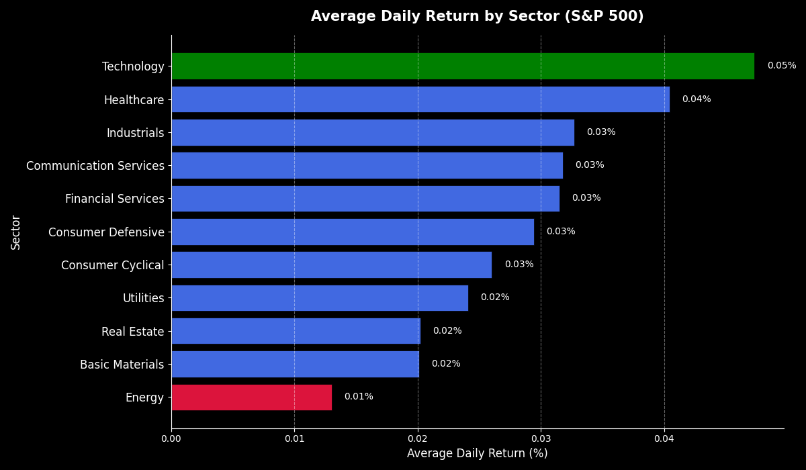

# Investor Insights - Stock Performance by Industry

## Hook

Despite decades of research and billions of dollars invested in analysis, predicting the stock market remains an untamed challenge in finance. However, advances in data analytics are providing new ways to better understand how markets behave and what factors drive stock performance.

## Problem Statement

Investing in the stock market can feel uncertain because there is no single factor that determines how a stock will perform. Company performance, economic conditions, global events, and investor behavior all play a role, making it challenging to consistently predict outcomes. Even with advanced tools and models, it is still difficult to fully explain why some stocks outperform others.

Looking at individual companies alone can also make things more complicated. With so much data available, it becomes difficult to see the bigger picture. Investors need a way to simplify this information and identify broader trends that can guide better decision making.

## Solution Description

All publicly traded companies in the stock market are divided into industry-based groupings, known as GICS Sectors. GICS (Global Industry Classification Standard) is a four-tiered system that classifies companies based on their principle business activity. The outermost classification of GICS is Sector, which contains the 11 following categories: Energy, Materials, Industrials, Consumer Discretionary, Consumer Staples, Health Care, Financials, Information Technology, Communication Services, Utilities, and Real Estate. These categories, or high-level industry classifications, have been used to group companies, which have led to useful analyses.

Over the past decade, sector performance has reflected major shifts in the global economy. The technology sector has consistently been one of the strongest performers, driven by rapid innovation and the increasing role of data and digital services in everyday life. Companies in this sector have benefited from growing demand for improved technologies, as well as the recent rise of artificial intelligence. The healthcare sector has also performed well, supported by ongoing innovation in medicine and increased attention to health and wellness. On the other hand, the energy sector has seen slower growth, influenced by changes in oil prices and a shift toward cleaner energy sources. These trends show how larger economic changes can impact entire industries, not just individual companies.

**Figure 1.** GICS Sectors

## Visualization of Performance by Sector

**Figure 2.** Stock Performance by Sectors 

This visualization demonstrates that the technology sector achieved the highest average daily return of approximately +0.5%. The healthcare sector followed as the second strongest performer, also demonstrating consistently positive returns. In contrast, the energy sector recorded the lowest performance, with average daily returns near +0.1%.
