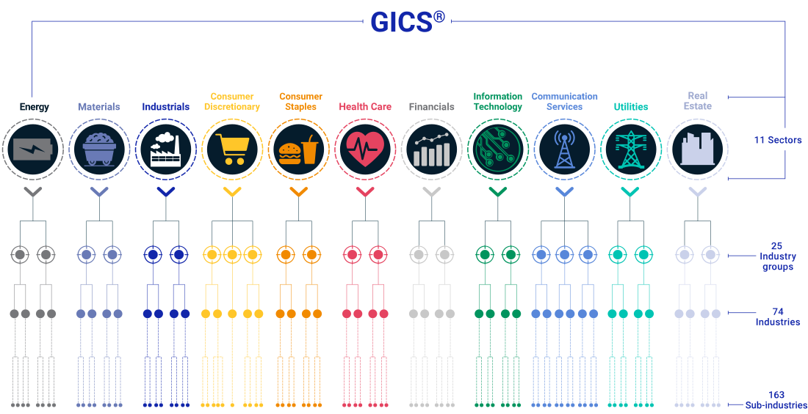

# Investor Insights - Stock Performance by Industry

## The performance of industries in the S&P 500 

## Problem Statement

The stock market can be one of the most unpredictable things we try to understand and control as people. Yet, despite all the efforts of analysts and investors, no one has a great understanding of why stocks behave the way they do, no one is able to precisely and confidently predict the trends of the stock market. As analysts, all that can be done is to build insights into the performance of stocks.

Many things can be considered when evaluating the performance ofa company in the stock market...

## Solution Description

All publicly traded companies in the stock market are divided into industry-based groupings, known as GICS Sectors. GICS (Global Industry Classification Standard) is a four-tiered system that classifies companies based on their principle business activity. The outermost classification of GICS is Sector, which contains the 11 following categories: 

**Figure 1.** GICS Sectors

## Visualization of Performance by Industry